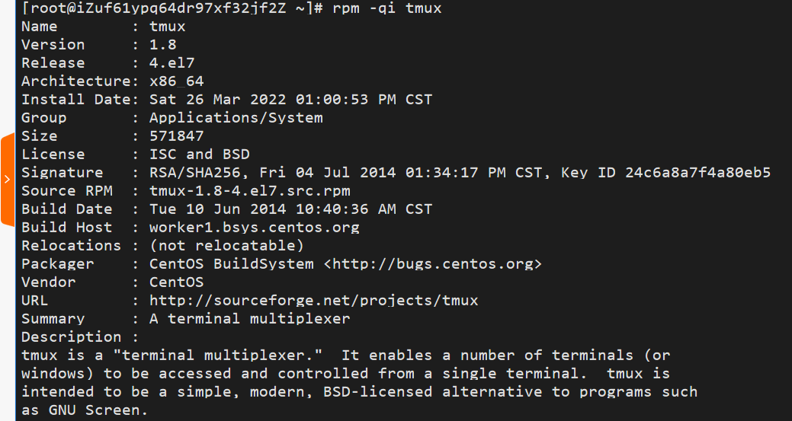

# Linux系统与网络管理——H2实验报告  
---   
### 实验问题
+ 使用表格方式记录至少 2 个不同```Linux```发行版本上以下信息的获取方法，使用```asciinema``` 录屏方式「分段」记录相关信息的获取过程和结果
+ 【软件包管理】在目标发行版上安装 ```tmux``` 和 ```tshark``` ；查看这 2 个软件被安装到哪些路径；卸载 ```tshark``` ；验证 ```tshark``` 卸载结果
+ 【文件管理】复制以下 ```shell``` 代码到终端运行，在目标 ```Linux``` 发行版系统中构造测试数据集，然后回答以下问题：
    + 找到 ```/tmp``` 目录及其所有子目录下，文件名包含 ```666``` 的所有文件
    + 找到 ```/tmp``` 目录及其所有子目录下，文件内容包含 ```666``` 的所有文
        ```
        cd /tmp && for i in $(seq 0 1024);do dir="test-$RANDOM";mkdir "$dir";
        echo "$RANDOM" > "$dir/$dir-$RANDOM";done
        ```
+ 【文件压缩与解压缩】练习课件中 文件压缩与解压缩 一节所有提到的压缩与解压缩命令的使用方法
+ 【跟练】 子进程管理实验
+ 【硬件信息获取】目标系统的 ```CPU```、内存大小、硬盘数量与硬盘容量
   
--- 

### 实验录屏—表格表示
+ **代码：**
 
|    | Ubuntu | Centos |
|----|  ----  |  ----  |
|安装软件|```sudo apt install```|```yum install```|
|查看安装路径|```dpkg -L```|```rpm -pl tmux```<br>or<br>```rpm -qal \|grep tmux```|
|卸载软件|```sudo apt-get --purge remove```|```yum remove```|
|文件名查找|```find ./ -name "*666*" 2>/dev/null```|```find ./ -name "*666*" 2>/dev/null```|
|文件内容查找|```grep -r "666" ./ --exclude=*.cast 2>/dev/null```|```grep -r "666" ./ --exclude=*.cast 2>/dev/null```|
|```gzip```压缩|```gzip h2_test.txt```|```gzip h2_test.txt```|
|```gzip```解压|```gzip -d h2_test.txt```|```gzip -d h2_test.txt```|
|```bzip2```压缩|```bzip2 hk_test.txt```|```bzip2 hk_test.txt```|
|```bzip2```解压|```bzip2 -d hk_test.txt.bz2```|```bzip2 -d hk_test.txt.bz2```|
|```zip```压缩|```zip test.zip hk_test.txt```|```zip test.zip hk_test.txt```|
|```zip```解压|```unzip test.zip```|```unzip test.zip```|
|```tar```压缩|```tar -czvf test.tar.gz ./*.txt```|```tar -czvf test.tar.gz ./*.txt```|
|```tar```解压|```tar -zxvf 【压缩包文件名.tar.gz】 -C  【路径】/```|```tar -zxvf 【压缩包文件名.tar.gz】 -C  【路径】/```|
|```p7zip```压缩|```7z a new_test.7z /home/cuc/*.txt```|```7za a new_test.7z /home/cuc/*.txt```|
|```p7zip```解压|```7z x new_test.7z -o./```|```7za x new_test.7z -o./```|
|```rar```压缩|```rar a hk.rar *.txt```|```rar a hk.rar *.txt```|
|```rar```解压|```rar x hk.rar```|```rar x hk.rar```|
|子进程管理|```ping www.baidu.com```<br>```CTRL-C```<br>```ping www.baidu.com &```<br>```CTRL-C```<br>```fg```<br>```CTRL-C```<br>```ping www.baidu.com 1>/dev/null 2>&1 &```<br>```ps aux \| grep ping```<br>```ping www.cuc.edu.cn 1>/dev/null 2>&1 &```<br>```killall ping```<br>  |  ```ping www.baidu.com```<br>```CTRL-C```<br>```ping www.baidu.com &```<br>```CTRL-C```<br>```fg```<br>```CTRL-C```<br>```ping www.baidu.com 1>/dev/null 2>&1 &```<br>```ps aux \| grep ping```<br>```ping www.cuc.edu.cn 1>/dev/null 2>&1 &```<br>```killall ping```<br>  |
|查看cpu|```cat /proc/cpuinfo```|```cat /proc/cpuinfo```|
|查看内存大小|```cat /proc/meminfo```or```free -m```|```cat /proc/meminfo```or```free -m```|
|查看硬盘数量与硬盘容量|```df -h```|```df -h```|


+ **录屏：**
 
|    | Ubuntu | Centos |
|----|  ----  |  ----  |
|软件包管理|[](https://asciinema.org/a/eqc3fnwkj6ZS1DqVcIZocSVKw) |[](https://asciinema.org/a/PLyNiVUTTtEDrhTsqtxjE2eh5)   [](https://asciinema.org/a/6iVLjCNRaHkyDNg5WBGnnp5Lv) |
|文件管理|[](https://asciinema.org/a/ka5wDa3492ysLU3HrDA1cw7Lh)| [](https://asciinema.org/a/NdVtVILP3HnclUnV67zvgl50p) |
|gzip|[](https://asciinema.org/a/hm2KxLvZJXyxRzmfiHiRLZ85z)|[](https://asciinema.org/a/gWDRPtOABVCMxULcGDbjM80AG) |
|bzip2|[](https://asciinema.org/a/H9YjpclXo5EY7lht4xjUT4oH8) |[](https://asciinema.org/a/IcMu5E8gwIsBMxnIpJXhTKvmj) |
|zip|[](https://asciinema.org/a/WE8VvVcGobyA4vQXyNUrFqAdw) |[](https://asciinema.org/a/Z6icHW29SbNOPFXyFRGLq1usD) |
|tar|[](https://asciinema.org/a/b3U8nJo5yZRsjrmC1ojLU4BCz) |[](https://asciinema.org/a/f8E07oHZhubCRwQEkdVVUxVaY) |
|p7zip|[](https://asciinema.org/a/RQcNFl1IK3AhH3l53kjcajjSW) |[](https://asciinema.org/a/6FcpEDrZ2ypUE54U3isAeUfLP) |
|rar|[](https://asciinema.org/a/cUCpZ4z3ME8LF4bKalYLsX6sE) |[](https://asciinema.org/a/gTnisiTP3Z91H1bYJvCKAjNxy) |
|子进程管理|[](https://asciinema.org/a/nGwe7FZQT1PeVIWlr7X9kj9ky) |[](https://asciinema.org/a/F0iH1XjXFyeyPdklJoh6y3iiy) |
|硬件信息获取|[](https://asciinema.org/a/nGwe7FZQT1PeVIWlr7X9kj9ky) |[](https://asciinema.org/a/0dKzlifMc4J3eh56InNwNtPNy) |

--- 

### 具体实验步骤
+ **准备工作：** 根据官网教程在本地和在线账号都安装并且配置好```asciinema```，在这里就不展示过程了，可以看到测试的录制是成功上传了的


+ **软件包管理** 
    + ```Ubuntu20.04```环境下:
        + 安装```tmux```并检查安装路径
            ``` 
            sudo apt install tmux    #安装tmux
            dpkg -L tmux             #查看tmux被安装到哪个路径
            ```
            
        + 安装```tshark```并检查安装路径
            ``` 
            sudo apt install tshark  #安装tshark
            dpkg -L tshark           #查tshark看被安装到哪个路径
            ```
            
        + 卸载```tshark```并检查卸载结果
            ``` 
            sudo apt-get --purge remove tshark  #卸载tshark并删除所有的配置文件
            dpkg -L tshark           #检查tshark是否被卸载
            ```
            
        + **录屏：** [](https://asciinema.org/a/eqc3fnwkj6ZS1DqVcIZocSVKw)
    + ```CentOS```环境下：
        + 安装```tmux```并检查安装路径
            ```
            yum install tmux     #安装
            ```
            
            ```
            which tmux           #安装路径
            rpm -qi tmux         #软件信息
            ```
            
            ```
            rpm -pl tmux         #查看软件被安装到哪些路径
            rpm -qal |grep tmux  #查看软件被安装到哪些路径
            ```
            
            **录屏：**
            [](https://asciinema.org/a/PLyNiVUTTtEDrhTsqtxjE2eh5)

        + 安装```tshark```并检查安装路径
            ```
            yum install wireshark     #安装包含tshark的wireshark包
            ```
            
            ```
            which tshark           #安装路径
            rpm -qi wireshark         #软件信息
            ```
            
            ```
            rpm -qal |grep tshark  #查看软件被安装到哪些路径
            ``` 
            
        + 卸载```tshark```并检查卸载结果
            ```
            yum remove tshark       #卸载tshark
            which tshark
            rpm -qi tshark
            rpm -pl tshark
            ```
            
            
            **录屏：**
            [](https://asciinema.org/a/6iVLjCNRaHkyDNg5WBGnnp5Lv)


+ **文件管理** 
    + ```Ubuntu20.04```环境下：
        + 复制以下 ```shell``` 代码到终端运行  
            ```
            cd /tmp && for i in $(seq 0 1024);do dir="test-$RANDOM";mkdir "$dir";
            echo "$RANDOM" > "$dir/$dir-$RANDOM";done
            ```
            在```Ubuntu20.04```中构造测试数据集
        + 找到 ```/tmp``` 目录及其所有子目录下，文件名包含 ```666``` 的所有文件
            ```
            cuc@cuc-lab:/tmp$ find ./ -name "*666*" 2>/dev/null
            ./test-15578/test-15578-20666
            ./test-4666
            ./test-4666/test-4666-15345
            ./test-26660
            ./test-26660/test-26660-27793
            ./test-6668
            ./test-6668/test-6668-24916
            ./test-9666
            ./test-9666/test-9666-18718
            ./test-24666
            ./test-24666/test-24666-12373
            ``` 
             
        + 找到 ```/tmp``` 目录及其所有子目录下，文件内容包含 ```666``` 的所有文件
            ```
            cuc@cuc-lab:/tmp$ grep -r "666" ./ --exclude=*.cast
            ./test-25253/test-25253-25017:24666
            ./test-20800/test-20800-11646:19666
            grep: ./systemd-private-4b3d2fb462ac4fa9aad3286572ec85ec-systemd-resolved.service-092N1f: Permission denied
            ./test-403/test-403-19741:4666
            ./test-4740/test-4740-17519:16668
            grep: ./systemd-private-4b3d2fb462ac4fa9aad3286572ec85ec-systemd-timesyncd.service-lz6YHf: Permission denied
            grep: ./systemd-private-4b3d2fb462ac4fa9aad3286572ec85ec-systemd-logind.service-5Y6Rwf: Permission denied
            grep: ./snap.lxd: Permission denied


            cuc@cuc-lab:/tmp$ grep -r "666" ./ --exclude=*.cast 2>/dev/null
            ./test-25253/test-25253-25017:24666
            ./test-20800/test-20800-11646:19666
            ./test-403/test-403-19741:4666
            ./test-4740/test-4740-17519:16668


            cuc@cuc-lab:/tmp$ sudo grep -r "666" ./ --exclude=*.cast
            [sudo] password for cuc:
            ./test-25253/test-25253-25017:24666
            ./test-20800/test-20800-11646:19666
            ./test-403/test-403-19741:4666
            ./test-4740/test-4740-17519:16668
            ``` 
            
        + 录屏：
            [](https://asciinema.org/a/ka5wDa3492ysLU3HrDA1cw7Lh)  
    
    + ```CentOS```环境下：
        + 复制以下 ```shell``` 代码到终端运行  
            ```
            cd /tmp && for i in $(seq 0 1024);do dir="test-$RANDOM";mkdir "$dir";
            echo "$RANDOM" > "$dir/$dir-$RANDOM";done
            ```
            在```CentOS```中构造测试数据集
        + 找到 ```/tmp``` 目录及其所有子目录下，文件名包含 ```666``` 的所有文件；找到 ```/tmp``` 目录及其所有子目录下，文件内容包含 ```666``` 的所有文件
        
        + **录屏：**
        [](https://asciinema.org/a/NdVtVILP3HnclUnV67zvgl50p) 
+ **文件压缩与解压缩**
    + ```Ubuntu20.04```环境下：
        + ```gzip```
            + 创建测试文件：
                  
            + 压缩：
                ```
                cuc@cuc-lab:/tmp$ gzip h2_test.txt
                cuc@cuc-lab:/tmp$ ls
                h2_test.txt.gz
                snap.lxd
                systemd-private-537b5cb4dde8439b81db5e44719d9814-systemd-logind.service-rZCtch
                systemd-private-537b5cb4dde8439b81db5e44719d9814-systemd-resolved.service-pQiadj
                systemd-private-537b5cb4dde8439b81db5e44719d9814-systemd-timesyncd.service-yUWCTe
                tmpylttbgb9-ascii.cast
                cuc@cuc-lab:/tmp$ cat h2_test.txt
                cat: h2_test.txt: No such file or directory
                cuc@cuc-lab:/tmp$ cat h2_test.txt.gz
                Bbh2_test.txt{hxcճ/O}YD
                ``` 
                    
            + 解压：   
                ```
                cuc@cuc-lab:/tmp$ gzip -d h2_test.txt
                cuc@cuc-lab:/tmp$ ls
                h2_test.txt
                snap.lxd
                systemd-private-537b5cb4dde8439b81db5e44719d9814-systemd-logind.service-rZCtch
                systemd-private-537b5cb4dde8439b81db5e44719d9814-systemd-resolved.service-pQiadj
                systemd-private-537b5cb4dde8439b81db5e44719d9814-systemd-timesyncd.service-yUWCTe
                tmpylttbgb9-ascii.cast
                cuc@cuc-lab:/tmp$ cat h2_test.txt
                这是一个测试。
                This is a test.
                ``` 
                 
            + **录屏：**
            [](https://asciinema.org/a/hm2KxLvZJXyxRzmfiHiRLZ85z)
        + ```bzip2``` 
            + 输出结果： 
              ```
              cuc@cuc-lab:/tmp$ cat hk_test.txt
              这是一个测试
              this is a test
              cuc@cuc-lab:/tmp$ bzip2 hk_test.txt
              cuc@cuc-lab:/tmp$ ls
              h2_test.txt
              hk_test.txt.bz2
              snap.lxd
              systemd-private-537b5cb4dde8439b81db5e44719d9814-systemd-logind.service-rZCtch
              systemd-private-537b5cb4dde8439b81db5e44719d9814-systemd-resolved.service-pQiadj
              systemd-private-537b5cb4dde8439b81db5e44719d9814-systemd-timesyncd.service-yUWCTe
              tmpmzr28kro-ascii.cast
              tmpylttbgb9-ascii.cast
              cuc@cuc-lab:/tmp$ cat hk_test.txt,bz2
              cat: hk_test.txt,bz2: No such file or directory
              cuc@cuc-lab:/tmp$ cat hk_test.txt.bz2
              BZh91AY&SYs%@"``@@ 1@C#&!iFI!UMܦ|]BA̖hcuc@cuc-lab:/tmp$ bzip2 -d hk_test.txt
              bzip2: Can't open input file hk_test.txt: No such file or directory.
              cuc@cuc-lab:/tmp$ bzip2 -d hk_test.txt.bz2
              cuc@cuc-lab:/tmp$ ls
              h2_test.txt
              hk_test.txt
              snap.lxd
              systemd-private-537b5cb4dde8439b81db5e44719d9814-systemd-logind.service-rZCtch
              systemd-private-537b5cb4dde8439b81db5e44719d9814-systemd-resolved.service-pQiadj
              systemd-private-537b5cb4dde8439b81db5e44719d9814-systemd-timesyncd.service-yUWCTe
              tmpmzr28kro-ascii.cast
              tmpylttbgb9-ascii.cast
              cuc@cuc-lab:/tmp$ cat hk_test.txt
              这是一个测试
              this is a test
              ```  
            + **录屏：**
            [](https://asciinema.org/a/H9YjpclXo5EY7lht4xjUT4oH8) 
        + ```zip```
            + 输出结果：
                ```
                cuc@cuc-lab:/tmp$ zip test.zip hk_test.txt
                   adding: hk_test.txt (stored 0%)
                cuc@cuc-lab:/tmp$ ls
                h2_test.txt
                hk_test.txt
                snap.lxd
                systemd-private-537b5cb4dde8439b81db5e44719d9814-systemd-logind.service-rZCtch
                systemd-private-537b5cb4dde8439b81db5e44719d9814-systemd-resolved.service-pQiadj
                systemd-private-537b5cb4dde8439b81db5e44719d9814-systemd-timesyncd.service-yUWCTe
                test.zip
                tmpylttbgb9-ascii.cast
                cuc@cuc-lab:/tmp$ cat test.zip
                PK
                F}Tf[""hk_test.txtUT BbBbux这是一个测试
                this is a test
                PK
                F}Tf[""hk_test.txtUTBbuxPKQgcuc@cuc-lab:/tmp$ unzip test.zip
                Archive:  test.zip
                replace hk_test.txt? [y]es, [n]o, [A]ll, [N]one, [r]ename: r
                new name: new_test
                 extracting: new_test
                cuc@cuc-lab:/tmp$ ls
                h2_test.txt
                hk_test.txt
                new_test
                snap.lxd
                systemd-private-537b5cb4dde8439b81db5e44719d9814-systemd-logind.service-rZCtch
                systemd-private-537b5cb4dde8439b81db5e44719d9814-systemd-resolved.service-pQiadj
                systemd-private-537b5cb4dde8439b81db5e44719d9814-systemd-timesyncd.service-yUWCTe
                test.zip
                tmpylttbgb9-ascii.cast
                cuc@cuc-lab:/tmp$ cat new_test
                这是一个测试
                this is a test
                ```  
            + **录屏：**
            [](https://asciinema.org/a/WE8VvVcGobyA4vQXyNUrFqAdw)
        + ```tar```
            + ```tar```后面有很多子命令，只能用一个，还有很多参数可以结合在一起使用
                ```
                -c: 建立压缩档案
                -x：解压
                -t：查看内容
                -r：向压缩归档文件末尾追加文件
                -u：更新原压缩包中的文件

                这五个是独立的命令，压缩解压都要用到其中一个，可以和别的命令连用但只能用其中一个。下面的参数是根据需要在压缩或解压档案时可选的。

                -z：有gzip属性的
                -j：有bz2属性的
                -Z：有compress属性的
                -v：显示所有过程
                -O：将文件解开到标准输出

                下面的参数-f是必须的

                -f: 使用档案名字，切记，这个参数是最后一个参数，后面只能接档案名。
                
                #例子：
                tar -czvf test.tar.gz ./*.txt  #压缩后缀为.txt的文件到test.tar.gz包
                tar -ztvf test.tar.gz  #查看压缩包内的文件
                tar -zxvf 【压缩包文件名.tar.gz】 -C  【路径】/
                ```
                 
            + **录屏：**
            [](https://asciinema.org/a/b3U8nJo5yZRsjrmC1ojLU4BCz)
        + ```7z```
            ```
            7z a new_test.7z /home/cuc/*.txt  #压缩指定目录下所有后缀是.txt的文件到new_test.7z中
            7z x new_test.7z -o./             #把new_test.7z解压到当前目录
            ``` 
            + **录屏：**
            [](https://asciinema.org/a/RQcNFl1IK3AhH3l53kjcajjSW) 
        + ```rar```
            ```
            rar a hk.rar *.txt   #压缩
            rar x hk.rar         #解压
            ```
            + **录屏：**
            [](https://asciinema.org/a/cUCpZ4z3ME8LF4bKalYLsX6sE)  
    
    + ```Centos```环境下：
        + ```gzip```
            + **录屏：**   
            [](https://asciinema.org/a/gWDRPtOABVCMxULcGDbjM80AG)
        + ```bzip2```
            + **录屏：**   
            [](https://asciinema.org/a/IcMu5E8gwIsBMxnIpJXhTKvmj) 
        + ```zip```
            + **录屏：**   
            [](https://asciinema.org/a/Z6icHW29SbNOPFXyFRGLq1usD) 
        + ```tar```
            + **录屏：**     
            [](https://asciinema.org/a/f8E07oHZhubCRwQEkdVVUxVaY)
        + ```7z```
            ```
            7za a new_test.7z /home/cuc/*.txt  #压缩指定目录下所有后缀是.txt的文件到new_test.7z中
            7za x new_test.7z -o./             #把new_test.7z解压到当前目录
            ``` 
            + **录屏：**
            [](https://asciinema.org/a/6FcpEDrZ2ypUE54U3isAeUfLP) 
             
        + ```rar``` 
            + **录屏：**  
            [](https://asciinema.org/a/gTnisiTP3Z91H1bYJvCKAjNxy) 


+ **子进程管理实验**
    + ```Ubuntu20.04```环境下
        ```
        # 执行以下ping命令后终端所有操作被“无视忽略掉”
        ping www.baidu.com
        # 直到使用CTRL-C快捷键组合输入，可以终止该ping进程
        CTRL-C
        # 我们试着把ping进程放到“后台”执行
        ping www.baidu.com &
        # 此时终端不断被“涌出”的ping输出结果“污染”
        # 此时CTRL-C无效
        CTRL-C
        # 以下“2连击”可以终止该ping进程
        fg
        CTRL-C
        # 我们再试着把ping进程放到“后台”执行，这一次我们把标准错误输出先重定向到标准输出，然后再把标准输出重定向到“黑洞”文件
        ping www.baidu.com 1>/dev/null 2>&1 &
        # 整个世界都清净了，终端不会再被“涌出”的ping输出结果“污染”
        # 查看进程会发现ping在“后台”一直运行着
        ps aux | grep ping
        ping www.cuc.edu.cn 1>/dev/null 2>&1 &
        # 杀死所有ping进程
        killall ping
        ```
        + **录屏：**
        [](https://asciinema.org/a/nGwe7FZQT1PeVIWlr7X9kj9ky)
    + ```Centos```环境下：
        + **录屏：** 
        [](https://asciinema.org/a/F0iH1XjXFyeyPdklJoh6y3iiy) 
     

        
+ **硬件信息获取**
    + ```Ubuntu20.04```环境下
        + 查看 ```CPU```
            ```
            cat /proc/cpuinfo
            ``` 
             
        + 查看内存大小
            ```
            free -m        #更直观的查看内存大小
            cat /proc/meminfo
            ``` 
             
        + 查看硬盘数量与硬盘容量
            ``` 
            df -h
            ``` 
             
        + **录像：**
        [](https://asciinema.org/a/3mZnLxpoNBxsDlpgCiQTyi3lo) 
    + ```Centos```环境下：
        + 查看 ```CPU```
            ```
            cat /proc/cpuinfo  
            ``` 
             
        + 查看内存大小
            ```
            free -m        #更直观的查看内存大小  
            cat /proc/meminfo  
            ``` 
             
        + 查看硬盘数量与硬盘容量
            ``` 
            df -h
            ``` 
             
        + **录像：**
        [](https://asciinema.org/a/0dKzlifMc4J3eh56InNwNtPNy)     

---
### 实验遇到的问题以及解决办法
+ 在使用``` find ./ -name "*666*"```命令进行“找到 ```/tmp``` 目录及其所有子目录下，文件名包含 ```666``` 的所有文件”操作时遇到了某些文件```Permission denied```的问题
 
    + **解决办法：**```permission denied```是由于权限不足，可以使用```sudo```，但是老师说“**不能一直```sudo```一直爽！**”   
    所以去搜索了其他办法，如果不想看到这样的报错信息可以进行错误转移：```find ./ -name "*666*" 2>/dev/null```，这个方法是将查找标准错误信息重定向到指定目录中去，```/dev/null```是一个“黑洞”文件，写进去就被黑洞吸收了，只可写，不可读。依照我的理解就是这并没有改变权限，也依旧没有读到，只是不显示报错信息了。
    **两个命令的对比：**
    
+ ```Centos```中```apt```命令没有安装，改用自带的```yum```可以达到一样的效果
+ 在```centos```使用```yum install tshark```安装时出现如下报错：
    ```
    Loaded plugins: fastestmirror, product-id, search-disabled-repos, subscription-manager

    This system is not registered with an entitlement server. You can use subscription-manager to register.

    Determining fastest mirrors
    base                                                                                                                          | 3.6 kB  00:00:00     
    epel                                                                                                                          | 4.7 kB  00:00:00     
    extras                                                                                                                        | 2.9 kB  00:00:00     
    updates                                                                                                                       | 2.9 kB  00:00:00     
    (1/5): epel/x86_64/group_gz                                                                                                   |  96 kB  00:00:00     
    (2/5): epel/x86_64/updateinfo                                                                                                 | 1.1 MB  00:00:00     
    (3/5): extras/7/x86_64/primary_db                                                                                             | 246 kB  00:00:00     
    (4/5): epel/x86_64/primary_db                                                                                                 | 7.0 MB  00:00:00     
    (5/5): updates/7/x86_64/primary_db                                                                                            |  14 MB  00:00:00     
    No package tshark available.
    Error: Nothing to do
    ``` 
    
    + 解决办法：```yum install wireshark```,```wireshark```包中包含了```tshark```
    + 参考网址：
        + [关于install_tshark的报错](https://stackoverflow.com/questions/8237395/installing-tshark-on-rhel)
        + [CentOS安装tshark抓包工具](https://www.cnblogs.com/alog9/p/11805716.html)
+ ```gzip```解压文件时可以不写压缩文件后缀，但是```bzip2```不写压缩后缀就会报错，必须写全。
+ ```7z```解压到指定路径时参数```-o```后没有空格直接加路径！
+ ```rar```压缩时多加一个斜杠``` rar a hk.rar /*.txt```就会报错，要注意区分各种解压命令的语法。
+ ```centos```直接```yum install rar```会报错提示找不到这个包。
    + **解决办法：** 参考[CentOS安装rar及用法](https://www.bbsmax.com/A/gAJGbL0gzZ/) 
        ```
        wget https://www.rarlab.com/rar/rarlinux-x64-611.tar.gz --no-check-certificate  #第一次下载的时候没有写“--no-check-certificate”，出现了报错
        tar -zxvf rarlinux-x64-611.tar.gz -C /tmp
        cd /tmp/rar
        make
        ```
        
        可以看到```make```之后就可以找到```rar```命令了。
+ ```.tar.xz```压缩包解压时层层解压：先解压```.xz```,再解压```.tar```
+ ```p7zip```使用```yum install p7zip```直接安装时会报错找不到这个包
    + **解决办法：** 参考[CentOS中如何安装7ZIP](https://www.cnblogs.com/yiwd/p/3649061.html)
    使用```yum install -y p7zip ```
    但是不知道```-y```的含义，去帮助手册查了一下：```-y, --assumeyes       answer yes for all questions```的意思，最后是安装成功了的。
+ 还有需要注意的是在```centos```环境使用```7z```会报错```-bash: 7z: command not found```，必须使用```7za```，但是在```Ubuntu```上二者都可以使用。            

---

### 参考文献
+ [asciinema官方文档](https://asciinema.org/docs/installation#installing-on-linux)
+ [7zip官方下载网址](https://www.7-zip.org/download.html)
+ [rar官方下载网址](https://www.rarlab.com/download.htm)
+ [linux 卸载软件命令](https://blog.csdn.net/cum44153/article/details/109041992)
+ [linux下find命令的使用和总结](https://www.cnblogs.com/lixuwu/p/7816390.html)
+ [Linux下find命令执行时出现Permission denied](https://blog.csdn.net/Homewm/article/details/104482667)
+ [centos7安装录像工具asciinema](https://blog.csdn.net/chen1986/article/details/82938792)
+ [centos如何安装软件](https://www.cnblogs.com/xwdreamer/p/3813880.html)
+ [CentOS系统查看软件安装路径](https://www.cnblogs.com/whq5051/p/15973721.html)
+ [centos如何安装软件](https://www.cnblogs.com/xwdreamer/p/3813880.html)
+ [linux压缩命令gzip](https://blog.csdn.net/cunchi4221/article/details/107470730)
+ [Linux bzip2命令](http://c.biancheng.net/view/786.html)
+ [Linux中zip压缩和unzip解压缩命令详解](https://www.cnblogs.com/flyoung/p/4784915.html)
+ [Linux下的tar压缩解压缩命令详解](https://www.cnblogs.com/manong--/p/8012324.html)
+ [linux解压7z文件命令](https://wenku.baidu.com/view/3939bc827f21af45b307e87101f69e314232fa38.html)
+ [linux命令解压压缩rar文件](https://www.cnblogs.com/qinglin/p/9007939.html)
+ [CentOS安装rar](https://www.cnblogs.com/linjiqin/archive/2013/03/24/2979736.html)
+ [tar.xz文件如何解压](https://blog.csdn.net/rheostat/article/details/7614451)
+ [查看linux运存](https://blog.csdn.net/weixin_42122878/article/details/113026460)
