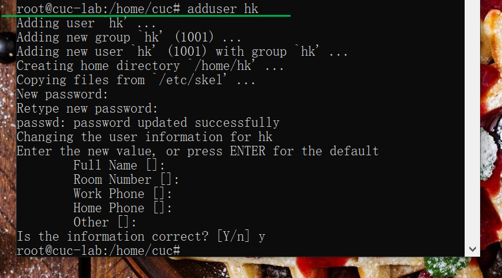
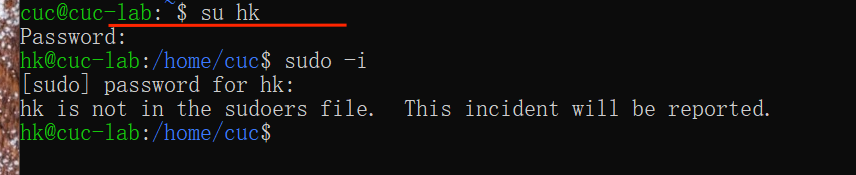
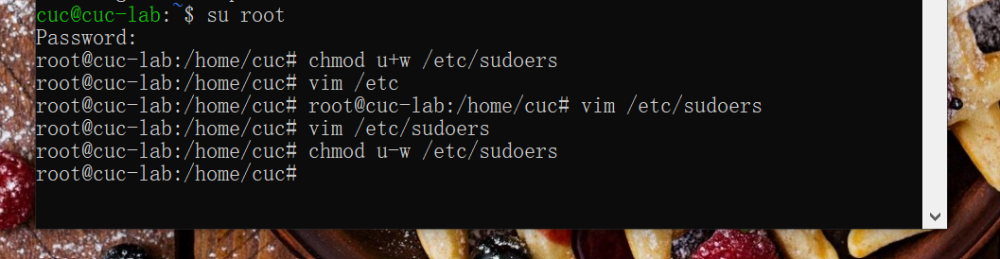

# Linux系统与网络管理——H3实验报告  

---
### 实验内容

+ 跟练[`Systemd` 入门教程：命令篇 by 阮一峰的网络日志](http://www.ruanyifeng.com/blog/2016/03/systemd-tutorial-commands.html)
+ 跟练[`Systemd` 入门教程：实战篇 by 阮一峰的网络日志](http://www.ruanyifeng.com/blog/2016/03/systemd-tutorial-part-two.html)

+ 如何添加一个用户并使其具备`sudo`执行程序的权限？
+ 如何将一个用户添加到一个用户组？
+ 如何查看当前系统的分区表和文件系统详细信息？
+ 如何实现开机自动挂载`Virtualbox`的共享目录分区？
+ 基于`LVM`（逻辑分卷管理）的分区如何实现动态扩容和缩减容量？
+ 如何通过`systemd`设置实现在网络连通时运行一个指定脚本，在网络断开时运行另一个脚本？
+ 如何通过`systemd`设置实现一个脚本在任何情况下被杀死之后会立即重新启动？实现杀不死？

### 入门跟练

+ **System 入门教程：命令篇跟练**

  + 3.1 `systemctl`

    ```
    # 重启系统
    $ sudo systemctl reboot
    
    # 关闭系统，切断电源
    $ sudo systemctl poweroff
    
    # CPU停止工作
    $ sudo systemctl halt
    
    # 暂停系统
    $ sudo systemctl suspend
    
    # 让系统进入冬眠状态
    $ sudo systemctl hibernate
    
    # 让系统进入交互式休眠状态
    $ sudo systemctl hybrid-sleep
    
    # 启动进入救援状态（单用户状态）
    $ sudo systemctl rescue
    ```

  + 3.2 `systemd-analyze`

    ```
    # 查看启动耗时
    $ systemd-analyze                                                                                       
    
    # 查看每个服务的启动耗时
    $ systemd-analyze blame
    
    # 显示瀑布状的启动过程流
    $ systemd-analyze critical-chain
    
    # 显示指定服务的启动流
    $ systemd-analyze critical-chain atd.service
    ```

    录屏：[](https://asciinema.org/a/EOm9D1gXMmln5MmYa7butgsUS)

  + 3.3 `hostnamectl`

    ```
    # 显示当前主机的信息
    $ hostnamectl
    
    # 设置主机名。
    $ sudo hostnamectl set-hostname rhel7
    ```

    录屏：[](https://asciinema.org/a/GZBU3pn2XaxTqQXYfLZRe9JVi)

  + 3.4 `localectl`

    ```
    # 查看本地化设置
    $ localectl
    
    # 设置本地化参数。
    $ sudo localectl set-locale LANG=en_GB.utf8
    $ sudo localectl set-keymap en_GB
    ```

    录屏：[](https://asciinema.org/a/XSiIrJB316OuW2474HqMrJR2q)

  + 3.5 `timedatectl`

    ```
    # 查看当前时区设置
    $ timedatectl
    
    # 显示所有可用的时区
    $ timedatectl list-timezones                                                                                   
    
    # 设置当前时区
    $ sudo timedatectl set-timezone America/New_York
    $ sudo timedatectl set-time YYYY-MM-DD
    $ sudo timedatectl set-time HH:MM:SS
    ```

    录屏：[](https://asciinema.org/a/9KBy05nPFAUOQ14VjeVQYW0in)

  + 3.6 `loginctl`

    ```
    # 列出当前session
    $ loginctl list-sessions
    
    # 列出当前登录用户
    $ loginctl list-users
    
    # 列出显示指定用户的信息
    $ loginctl show-user ruanyf
    ```

    录屏：[](https://asciinema.org/a/8GEIOSppMA25YzkF1mPjuZuai)

  + 4.1 `systemctl list-units`

    ```
    # 列出正在运行的 Unit
    $ systemctl list-units
    
    # 列出所有Unit，包括没有找到配置文件的或者启动失败的
    $ systemctl list-units --all
    
    # 列出所有没有运行的 Unit
    $ systemctl list-units --all --state=inactive
    
    # 列出所有加载失败的 Unit
    $ systemctl list-units --failed
    
    # 列出所有正在运行的、类型为 service 的 Unit
    $ systemctl list-units --type=service
    ```

    录屏：[](https://asciinema.org/a/hzXt7YpTDyY4Dk2vjaUDi1GrP)

  + 4.2 `Unit` 的状态

    ```
    # 显示系统状态
    $ systemctl status
    
    # 显示单个 Unit 的状态
    $ systemctl status bluetooth.service
    
    # 显示远程主机的某个 Unit 的状态
    $ systemctl -H root@rhel7.example.com status httpd.service
    ```

    录屏：[](https://asciinema.org/a/82RmebbwWur59cyH46Nh3j8ry)

    除了`status`命令外三个查询状态的简单方法，主要供脚本内部的判断语句使用：

    ```
    # 显示某个 Unit 是否正在运行
    $ systemctl is-active application.service
    
    # 显示某个 Unit 是否处于启动失败状态
    $ systemctl is-failed application.service
    
    # 显示某个 Unit 服务是否建立了启动链接
    $ systemctl is-enabled application.service
    ```

    录屏：

  + 4.3 `Unit` 管理

    ```
    
        # 立即启动一个服务
        $ sudo systemctl start apache.service
    
        # 立即停止一个服务
        $ sudo systemctl stop apache.service
    
        # 重启一个服务
        $ sudo systemctl restart apache.service
    
        # 杀死一个服务的所有子进程
        $ sudo systemctl kill apache.service
    
        # 重新加载一个服务的配置文件
        $ sudo systemctl reload apache.service
    
        # 重载所有修改过的配置文件
        $ sudo systemctl daemon-reload
    
        # 显示某个 Unit 的所有底层参数
        $ systemctl show httpd.service
    
        # 显示某个 Unit 的指定属性的值
        $ systemctl show -p CPUShares httpd.service
    
        # 设置某个 Unit 的指定属性
        $ sudo systemctl set-property httpd.service CPUShares=500
    
    ```

    录屏：[](https://asciinema.org/a/H15iTUERvxhKQgxPJJAvb6DNb)

  + 4.4 依赖关系

    ```
    $ systemctl list-dependencies nginx.service
    $ systemctl list-dependencies --all nginx.service
    ```

    录屏：[](https://asciinema.org/a/IeW7FS0WCp9txcnDvVteMImxV)

  + 5.2 配置文件的状态

    ```
    # 列出所有配置文件
    $ systemctl list-unit-files
    
    # 列出指定类型的配置文件
    $ systemctl list-unit-files --type=service
    ```

  + 5.3 配置文件格式

    ```
    $ systemctl cat atd.service
    ```

    录屏：[](https://asciinema.org/a/AvLOjyBDohLIMUgrX7oGFqfsT)

  + `Target`

    ```
    # 查看当前系统的所有 Target
    $ systemctl list-unit-files --type=target
    
    # 查看一个 Target 包含的所有 Unit
    $ systemctl list-dependencies multi-user.target
    
    # 查看启动时的默认 Target
    $ systemctl get-default
    
    # 设置启动时的默认 Target
    $ sudo systemctl set-default multi-user.target
    
    # 切换 Target 时，默认不关闭前一个 Target 启动的进程，
    # systemctl isolate 命令改变这种行为，
    # 关闭前一个 Target 里面所有不属于后一个 Target 的进程
    $ sudo systemctl isolate multi-user.target
    ```

    录屏：[](https://asciinema.org/a/a5k5Z2WJhUTyarowY71KANfJJ)

  + 日志管理

    ```
    # 查看所有日志（默认情况下 ，只保存本次启动的日志）
    $ sudo journalctl
    
    # 查看内核日志（不显示应用日志）
    $ sudo journalctl -k
    
    # 查看系统本次启动的日志
    $ sudo journalctl -b
    $ sudo journalctl -b -0
    
    # 查看上一次启动的日志（需更改设置）
    $ sudo journalctl -b -1
    
    # 查看指定时间的日志
    $ sudo journalctl --since="2012-10-30 18:17:16"
    $ sudo journalctl --since "20 min ago"
    $ sudo journalctl --since yesterday
    $ sudo journalctl --since "2015-01-10" --until "2015-01-11 03:00"
    $ sudo journalctl --since 09:00 --until "1 hour ago"
    
    # 显示尾部的最新10行日志
    $ sudo journalctl -n
    
    # 显示尾部指定行数的日志
    $ sudo journalctl -n 20
    
    # 实时滚动显示最新日志
    $ sudo journalctl -f
    
    # 查看指定服务的日志
    $ sudo journalctl /usr/lib/systemd/systemd
    
    # 查看指定进程的日志
    $ sudo journalctl _PID=1
    
    # 查看某个路径的脚本的日志
    $ sudo journalctl /usr/bin/bash
    
    # 查看指定用户的日志
    $ sudo journalctl _UID=33 --since today
    
    # 查看某个 Unit 的日志
    $ sudo journalctl -u nginx.service
    $ sudo journalctl -u nginx.service --since today
    
    # 实时滚动显示某个 Unit 的最新日志
    $ sudo journalctl -u nginx.service -f
    
    # 合并显示多个 Unit 的日志
    $ journalctl -u nginx.service -u php-fpm.service --since today
    
    # 查看指定优先级（及其以上级别）的日志，共有8级
    # 0: emerg
    # 1: alert
    # 2: crit
    # 3: err
    # 4: warning
    # 5: notice
    # 6: info
    # 7: debug
    $ sudo journalctl -p err -b
    
    # 日志默认分页输出，--no-pager 改为正常的标准输出
    $ sudo journalctl --no-pager
    
    # 以 JSON 格式（单行）输出
    $ sudo journalctl -b -u nginx.service -o json
    
    # 以 JSON 格式（多行）输出，可读性更好
    $ sudo journalctl -b -u nginx.serviceqq
     -o json-pretty
    
    # 显示日志占据的硬盘空间
    $ sudo journalctl --disk-usage
    
    # 指定日志文件占据的最大空间
    $ sudo journalctl --vacuum-size=1G
    
    # 指定日志文件保存多久
    $ sudo journalctl --vacuum-time=1years
    ```

    录屏：[](https://asciinema.org/a/JHpN8bvkypRmWEUzHn7Mc1z3S)

+ **System 入门教程：实战篇跟练**

  + 开机启动、启动服务、停止服务

    ```
    #开机启动
    $ sudo systemctl enable httpd
    
    #不经过下次重启，直接现在就运行该软件
    $ sudo systemctl start httpd
    
    #查看服务器状态
    $ sudo systemctl status httpd
    
    #终止正在运行的服务
    $ sudo systemctl stop httpd.service
    
    #强制"杀进程"
    $ sudo systemctl kill httpd.service
    
    #重启服务
    $ sudo systemctl restart httpd.service
    ```

    录屏：[](https://asciinema.org/a/mzWoOg46b2Xvm9xPOLdSvebO4)

  + 读懂配置文件

    ```
    #查看配置文件
    $ systemctl cat sshd.service
    ```

  + `Install`区块

    ```
    #Systemd 有默认的启动 Target。
    $ systemctl get-default
    
    # 查看 multi-user.target 包含的所有服务
    $ systemctl list-dependencies multi-user.target
    
    # 切换到另一个 target
    # shutdown.target 就是关机状态
    $ sudo systemctl isolate shutdown.target
    
    ```

    录屏：[](https://asciinema.org/a/zuOsDJ1C92hRJlLy6vBq2uqg9)

  + `Target` 的配置文件

    ```
    $ systemctl cat multi-user.target
    
    # 重新加载配置文件
    $ sudo systemctl daemon-reload
    
    # 重启相关服务
    $ sudo systemctl restart foobar
    ```

    录屏：[](https://asciinema.org/a/dYEOQbQYGxwNllTbJm2fwAhFn)

### 自查清单

+ **如何添加一个用户并使其具备`sudo`执行程序的权限？**

    + 进入超级用户`su root`
    + 添加一个用户`adduser hk`
    
    + 检查`hk`的`sudo`权限
     
    缺少权限
    + 为`hk`添加`sudo`权限：
        ```
        cuc@cuc-lab:~$ su root
        Password:
        root@cuc-lab:/home/cuc# chmod u+w /etc/sudoers
        root@cuc-lab:/home/cuc# root@cuc-lab:/home/cuc# vim /etc/sudoers
        root@cuc-lab:/home/cuc# vim /etc/sudoers
        root@cuc-lab:/home/cuc# chmod u-w /etc/sudoers
        root@cuc-lab:/home/cuc#
        ```
        
        
    + 再次检查`hk`的`sudo`权限
    
    权限添加成功

+ **如何将一个用户添加到一个用户组？**
    + 查看所有用户`cat /etc/passwd`
    + 查看用户组`cat /etc/group`
     
    + 添加`hk`用户到`adm`用户组
     

+ **如何查看当前系统的分区表和文件系统详细信息？**

    在使用`fdisk -l`命令时一定要加上`sudo`，否则什么也不能输出。  

    **常用用法：**

    `fdisk -l`查看当前的磁盘分区信息（主要是分区表信息）

    `fdisk /dev/sda` 对磁盘`/dev/sda` 进行分区操作

    **`fdisk` 与 `df` 的区别：**

    1. `fdisk` 工具是分区工具，查看分区信息时侧重于显示分区表的信息
    2. `df` 是用来查看文件系统分区的使用情况的，侧重于显示当前系统中所有文件系统的信息
    3. `df -h` 查看当前文件系统信息、包括容量大小、使用情况、挂载点等

    ```
    # 查看硬盘及其分区信息
    $ sudo fdisk -l
    
    # 查看指定硬盘分区情况
    $ sudo fdisk -l /dev/sda
    
    # 查看文件系统详细信息
    $ sudo dumpe2fs [-h] 文件名
    
    # 查看当前文件系统信息
    $ df -h
    ```

    录屏：[](https://asciinema.org/a/Sx8O0CrAIQ0hxARC6KClAaHhE)

+ **如何实现开机自动挂载 `Virtualbox` 的共享目录分区？**

    + 用`VirtualBox` 虚拟机的共享文件夹设置共享的本地文件`share_hk` 

      

    + 在虚拟机上创建一个共享目录

      ```
      $ sudo mkdir /mnt/share
      ```

    + 实现挂载

      ```
      $ sudo mount -t vboxsf share_hk /mnt/share/
      ```

    + 进入`/mnt/share` 就可以看到共享文件夹

    + 实现开机自动挂载：

      ```
      # 打开并修改 /etc/fstab 文件
      # 由于该文件readonly，所以使用sudo命令修改
      $ sudo vim /etc/fstab
      
      # 在文件最后添加以下语句
      $ share_cynthia /mnt/share/ vboxsf default 0  0
      ```

      录屏：[](https://asciinema.org/a/gxkcwhTVDmw6OhmarkdBjcrRK)

+ 基于`LVM`（逻辑分卷管理）的分区如何实现动态扩容和缩减容量？

  ```
  # 展示磁盘信息
  $ vgdisplay
  
  # 实现扩展容量
  $ lvextend -L +10G /dev/mapper/ubuntu--vg-ubuntu--lv 
  
  # 实现缩减容量
  $ lvreduce -L -10G /dev/mapper/ubuntu--vg-ubuntu--lv
  ```

  录屏：[](https://asciinema.org/a/sc7wyR0EaaqeKUaGEWT3r0vwG)

+ 如何通过`systemd`设置实现在网络连通时运行一个指定脚本，在网络断开时运行另一个脚本？

    **编写脚本**

    ```
    # 创建脚本1
    $ touch test.sh
    
    # 使用vim对脚本进行编辑
    $ vim test.sh
    
    # 脚本内容如下：
    #!/bin/bash
    string="HELLO,WORLD!\n"
    echo -e ${string}
    exit 0
    
    # 创建脚本2
    $ touch over.sh
    
    $ vim over.sh
    
    # 脚本内容如下：
    #!/bin/bash
    string="GOODBYE!\n"
    echo -e ${string}
    exit 0
    ```

    

    **编辑配置文件**

    ```
    [Unit]
    After=network-online.target
    [Service]
    Type=oneshot
    ExecStart=/bin/bash -e /home/cuc/test.sh
    KillSignal=SIGINT
    After=network-online.target
    RemainAfterExit=yes
    [Install]
    WantedBy=network-online.target
    ```

    **运行**

    

    

+ 如何通过`systemd`设置实现一个脚本在任何情况下被杀死之后会立即重新启动？实现杀不死？

    + 在配置文件`[Service]`中添加如下代码：

      ```
      StartLimitIntervalSec=0
      Restart=always
      RestartSec=1
      ```

    + 重新加载配置文件 `sudo systemctl daemon-reload`
    + 重启服务`sudo systemctl restart 服务名`


### 实验遇到的问题及解决办法
+ 普通用户切换`root`用户输入密码后提示：`su: Authentication failure`
   
  
    + **解决办法：**
        ```
        cuc@cuc-lab:~$ sudo passwd root
        New password:
        Retype new password:
        passwd: password updated successfully
        cuc@cuc-lab:~$ su root
        Password:
        root@cuc-lab:/home/cuc#
        ```
  
+ 将用户添加到用户组时出现报错：
    ```
    cuc@cuc-lab:~$ usermod -a -G adm hk
    usermod: Permission denied.
    usermod: cannot lock /etc/passwd; try again later.
    ```
    + **解决办法：** 直接`sudo`
    
+ 在挂载共享目录时，出现报错：

    ```
    wrong fs type, bad option, bad superblock on share_hk, missing codepage or helper program, or other error.
    ```

    直接去搜索这个错误很多显示的都是没有安装`mount.nfs`，但是安装之后还是出现同样的报错，最后确定了是没有安装`vboxsf` 的缘故。安装之后要重启才能生效，否则还是报错。

### 参考文献

+ [Authentication failure解决办法](https://blog.csdn.net/qq_40511918/article/details/83650536)
+ [Linux中给普通用户添加`sudo`权限](https://www.cnblogs.com/zhangwuji/p/9152551.html)
+ [Linux 将一个用户添加到某一用户组中](https://blog.csdn.net/yabingshi_tech/article/details/46874179)
+ [usermod: cannot lock /etc/passwd; try again later.](https://serverfault.com/questions/1053446/usermod-cannot-lock-etc-passwd-when-usermod-is-in-etc-sudoers-as-nopasswd)
+ [Linux命令学习——fdisk-l查看硬盘及分区信息](https://wenku.baidu.com/view/799d41e32fc58bd63186bceb19e8b8f67d1cef4a.html)
+ [linux下编写脚本文件 .sh](https://blog.csdn.net/ZzH7HN/article/details/108221257?utm_medium=distribute.pc_aggpage_search_result.none-task-blog-2~aggregatepage~first_rank_ecpm_v1~rank_v31_ecpm-1-108221257-null-null.pc_agg_new_rank&utm_term=linux%E4%B8%8B%E6%80%8E%E4%B9%88%E5%86%99%E8%84%9A%E6%9C%AC%E6%96%87%E4%BB%B6&spm=1000.2123.3001.4430)